Users DB APP 1.0.0
==================

Users DB APP é uma aplicação para gerenciar o cadastro de usuários em um banco de dados SQL Server.

Conteúdo
--------

- [Instalação](#instalação)
- [Importando arquivo do Banco de Dados](#importando-arquivo-do-banco-de-dados)
- [Configuração do Banco de Dados](#configuração-do-banco-de-dados)
- [Login](#login)
- [Cadastro de Usuários](#cadastro-de-usuários)
- [Pesquisa de Usuários](#pesquisa-de-usuários)
- [Gerando Relatórios](#gerando-relatórios)

Instalação
----------

Para criar e configurar o banco de dados da aplicação foi usado a versão de desenvolvedor do softoware [Microsoft SQL Server Management Studio 18][microsof-sql-server-management-studio-18].

[microsof-sql-server-management-studio-18]: https://www.microsoft.com/pt-br/sql-server/sql-server-downloads

Após a Instalação e o Download do software, ao abrir o programa a seguinte tela será exibida:

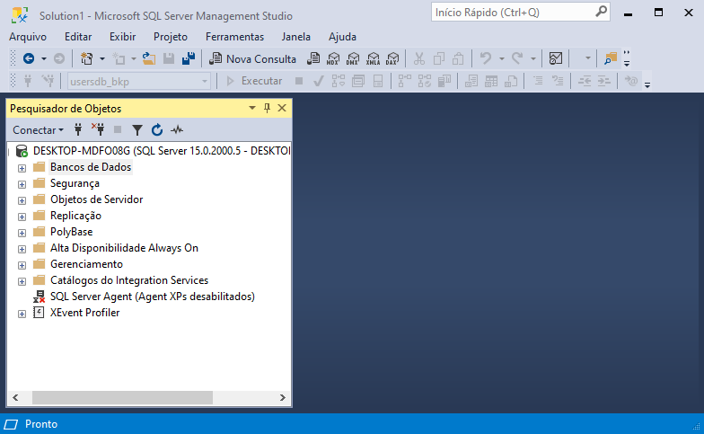

Importando arquivo do Banco de Dados
------------------------------------

1 - Criar um banco de dados.

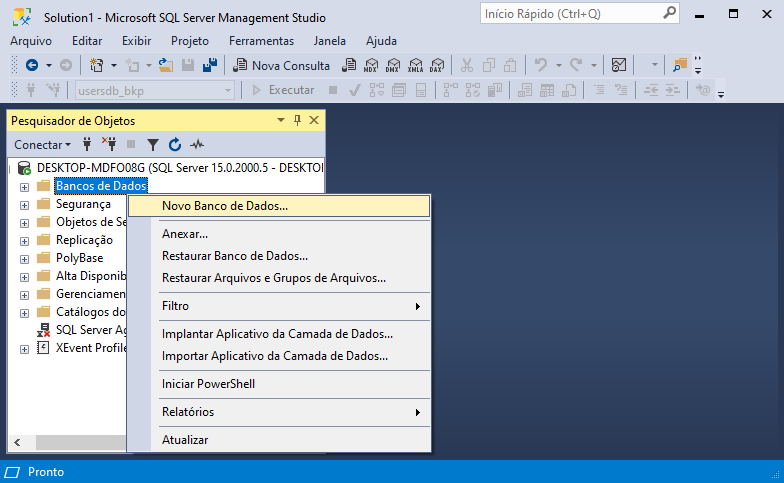

2 - Informar o nome do banco de dados "usersdb" e clicar em OK.

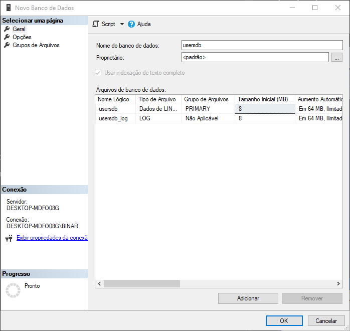

3 - Ir na opção "Importar Arquivo Simples".

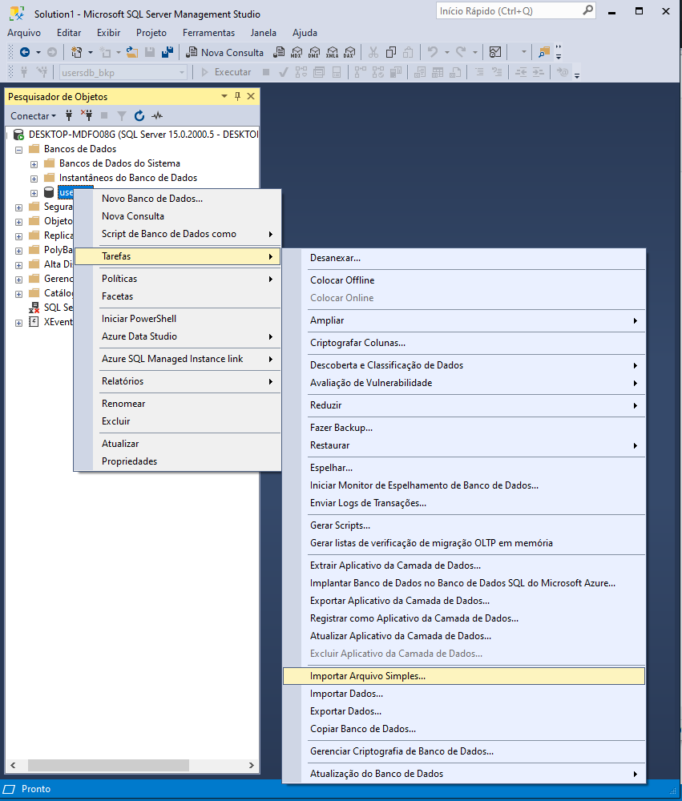

4 - Clicar em "Próxima >", procurar e selecionar o arquivo [users.csv][users-csv].

[users-csv]: https://github.com/WesleyJoseSantos/UsersDBApp/tree/main/UsersDBApp/bin/Release/users.csv

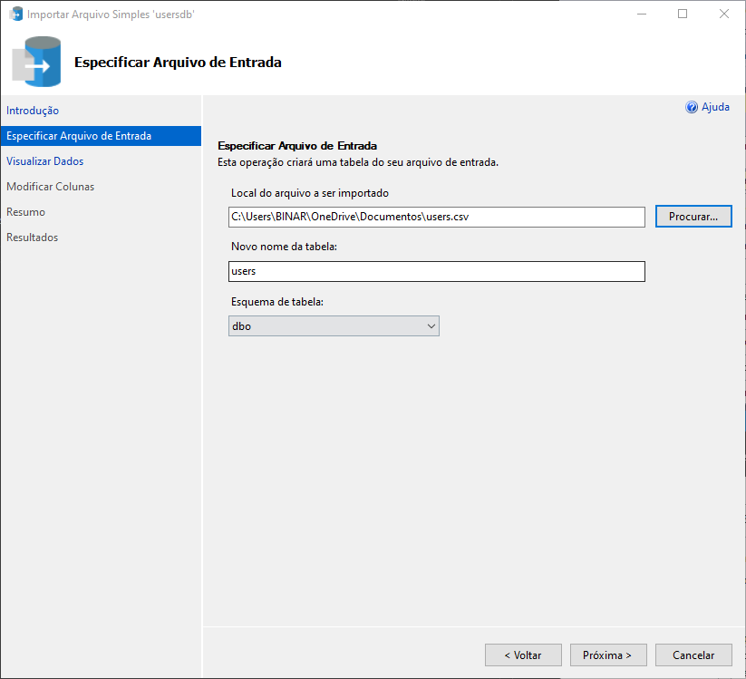

5 - Clicar em "Próxima >" duas vezes. Marcar a coluna "Id" como chave primária. 

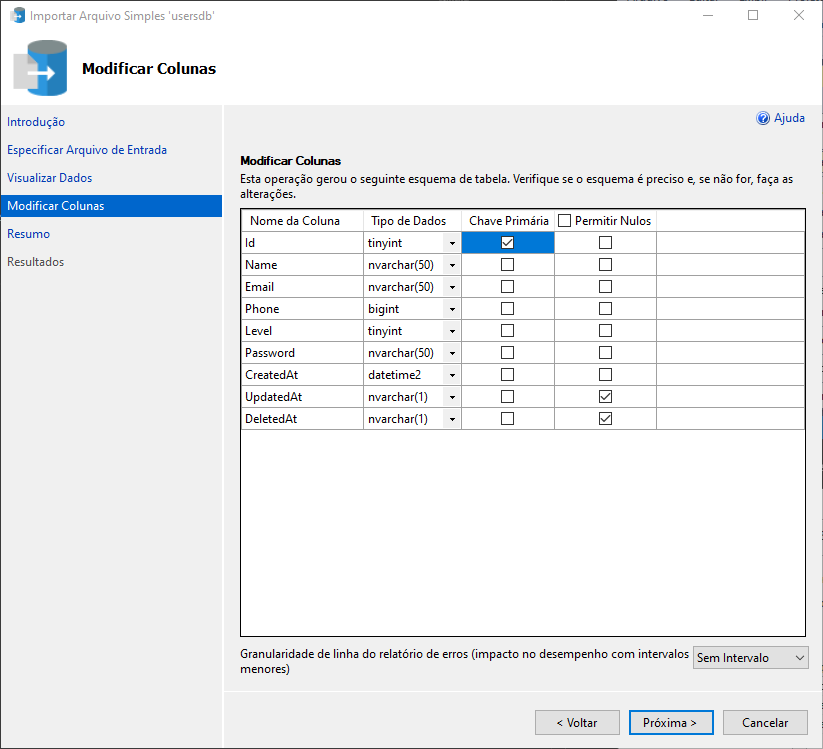

6 - Clicar em "Próxima >" e concluir a importação do arquivo. A tabela "users" deverá aparecer no banco de dados.

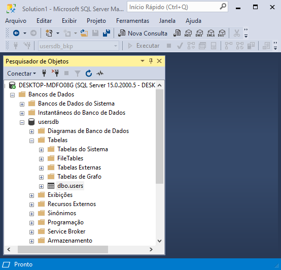

Configuração do Banco de Dados
------------------------------

1 - No menu superior, ir em "Ferramentas->Opções", navegar até "Designers" e desmarcar a opção "Evitar salvar alterações que exijam recriação de tabela"

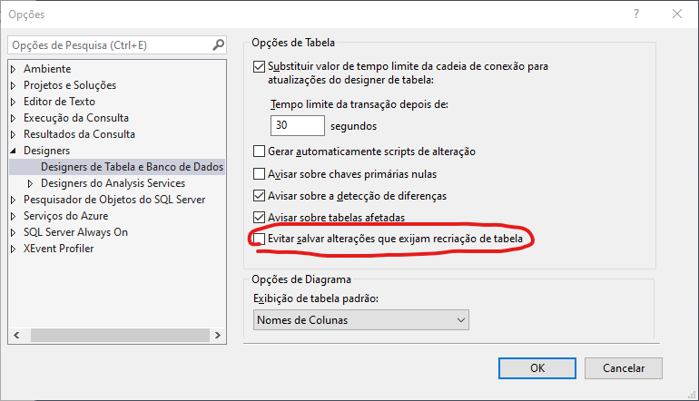

2 - Abrir o design da tabela "users"

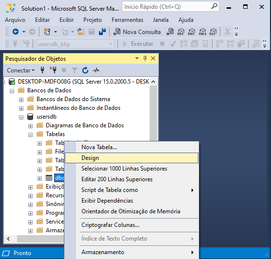

3 - Selecionar a coluna "Id" e na aba "Propriedades da Coluna" alterar a propriedade "(É Identidade)" para "Sim"

4 - Fechar a tabela e salvar as alterações.

Login
-----

Ao abrir a aplicação pela primeira vez, a tela de login será exibida. Para entrar como administrador utilizar as credenciais:

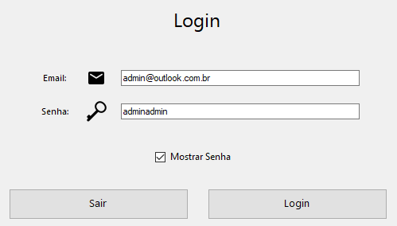

Cadastro de Usuários
--------------------

Para cadastrar um novo usuário deve ser utilizado a opção "Cadastrar Usuário" no menu.

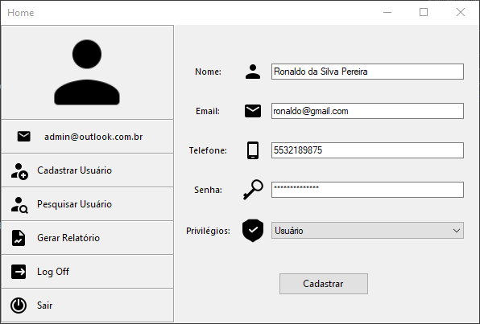

A senha deve possuir mais que 8 caracteres, e a opção "Privilégios" irá controlar o grau de interação permitido ao usuário, sendo possível as sequintes opções:

1 - Nenhum: Permite apenas realizar o login na plataforma.

2 - Usuário: Permite realizar login, listar usuários, e gerar relatórios.

3 - Administrador: Permite realizar o login, criar/listar usuários, e gerar relatórios.

Pesquisa de Usuários
--------------------

Para pesquisar um usuário, deve ser utilizado a opção "Pesquisar Usuário" no menu.

Basta informar uma parte do nome na caixa de texto e clicar em pesquisar. Para listar todos os usuários pode ser utilizado o caractere '*'.

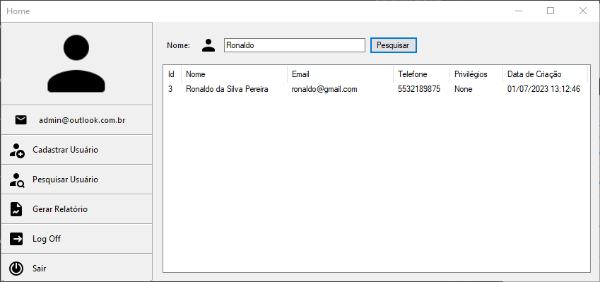

Gerando Relatórios
------------------

Para gerar um relatório, deve ser utilizado a opção "Gerar Relatório" no menu.

É possível selecionar o arquivo de destino, o formato da página, e definir um título personalizado.

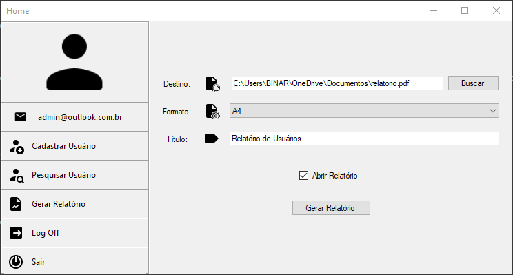

Após clicar em "Gerar Relatório", caso o check box "Abrir Relatório" esteje ativado, o arquivo criado será aberto.

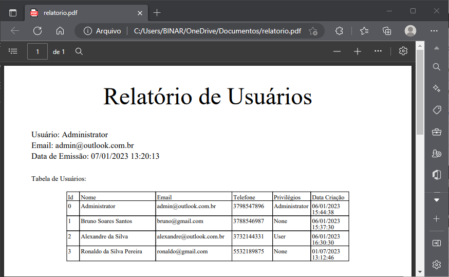
